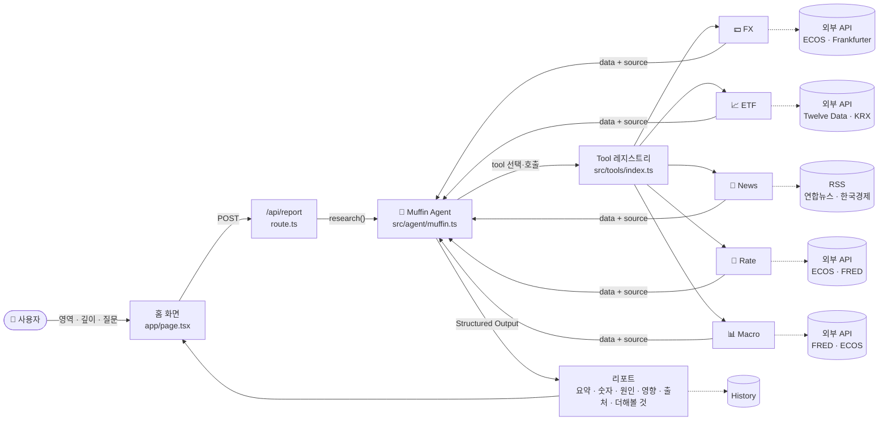
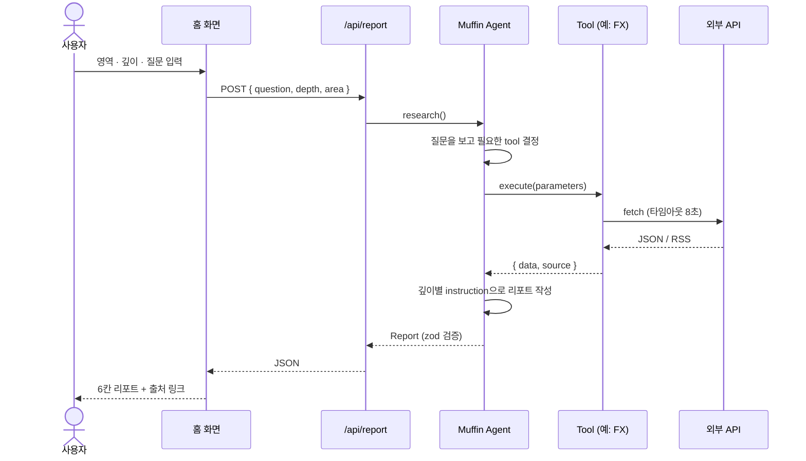
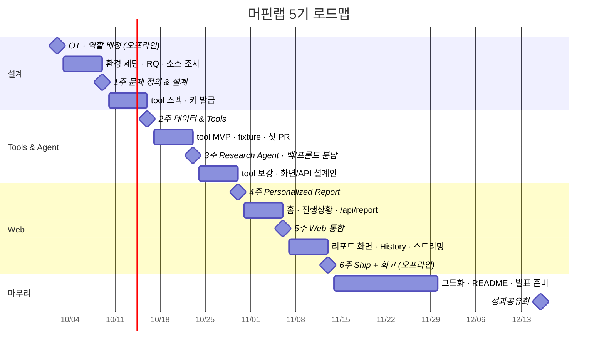

# 🧁 Muffin Lab — Money & Finance Intelligence Agent

환율, ETF, 경제뉴스, 금리, 물가 등 궁금한 금융 영역을 고르면 Agent가 필요한 Tool을 판단해 데이터를 조사하고, 핵심 변화와 원인을 **출처와 함께** 정리해주는 AI 금융 리서치 웹 서비스입니다.

> 내가 궁금한 것부터, 내가 이해할 수 있는 깊이로.

## 핵심 기능

- 관심 영역 선택: 환율 / ETF / 뉴스 / 금리 / 물가 (물가는 Macro Tool이 담당)
- 설명 깊이 선택: `Easy` / `Standard` / `Deep Dive`
- 자유 질문 입력
- Agent 실행 과정 실시간 표시
- 출처가 포함된 구조화 리포트 (한입 요약 · 오늘의 숫자 · 왜 그럴까요 · 영향 · 더해볼 것)
- 리포트 History (MVP는 브라우저 localStorage, 고도화 기간에 서버 저장으로 확장)
- (선택) PDF / Notion / Google Sheets Export

**범위 밖**: UI 콘셉트 이미지에 있는 부동산 영역, AI스토리, Pro 업그레이드, 설정 페이지는 만들지 않습니다.

## 기술 스택

Next.js (App Router) · React · TypeScript · OpenAI Agents SDK · Zod · Codex · GitHub Actions · Vercel

## 요구 환경

| 항목 | 버전 | 비고 |
|---|---|---|
| Node.js | 20 이상 | `node -v` |
| pnpm | 10 | `npm i -g pnpm@10` 또는 `corepack enable` |
| Codex CLI | 최신 | `npm i -g @openai/codex` 후 `codex` 실행해 로그인 |
| OpenAI API Key | 개인 키 | 발급이 어려우면 리더에게 요청 (사용량 제한 걸린 프로젝트 키 발급) |

---

## 아키텍처

```
[Muffin Web — Next.js]
   app/…                      프론트: 홈, 진행상황, 리포트, History
   app/api/report/route.ts    백엔드: Agent 실행 + 스트리밍 + 저장
        │
   src/agent/muffin.ts        Orchestrator Agent (리더)
        │  tools: [...]
   src/tools/index.ts         Tool 레지스트리
        ├─ fx/      💵 FX Tool     환율
        ├─ etf/     📈 ETF Tool    ETF·시장 데이터
        ├─ news/    📰 News Tool   경제뉴스
        ├─ rate/    🏦 Rate Tool   금리
        └─ macro/   📊 Macro Tool  주요 경제지표 (물가 포함)
```

사용자 흐름: 관심 영역 + 깊이 + 질문 → Agent가 tool 선택·호출 → Structured Report → History 저장



Agent는 깊이(Easy / Standard / Deep Dive)에 따라 다른 instruction을 받고, 같은 데이터를 다른 길이와 용어로 풀어 씁니다.



## 디렉토리 구조

```
muffin-lab/
├─ app/
│  ├─ page.tsx                 홈 (영역·깊이 선택, 질문 입력, 리포트 표시) — 뼈대
│  ├─ report/[id]/page.tsx     리포트 상세 (4주차, 프론트 팀)
│  ├─ history/page.tsx         저장한 리포트 (5주차, 프론트 팀)
│  └─ api/report/route.ts      POST /api/report — 지금은 JSON 응답, 4주차에 스트리밍 (백엔드 팀)
├─ src/
│  ├─ agent/
│  │  ├─ muffin.ts             Orchestrator Agent
│  │  ├─ instructions.ts       깊이별 instruction
│  │  └─ schema.ts             리포트 zod 스키마 (Structured Output)
│  ├─ tools/
│  │  ├─ index.ts              레지스트리 (리더만 수정)
│  │  ├─ types.ts              ToolResult / Source 공통 타입
│  │  ├─ _template/            새 tool 시작용 템플릿 (USD/KRW 샘플, 실제로 동작)
│  │  │  ├─ index.ts           parameters / execute / tool 정의
│  │  │  ├─ run.ts             단독 실행 스크립트
│  │  │  ├─ fixture.json       샘플 응답 (테스트·시연용)
│  │  │  ├─ index.test.ts      fixture 기반 테스트
│  │  │  └─ README.md          데이터 소스·키 발급·제한 기록
│  │  └─ fx/ etf/ news/ rate/ macro/   (같은 구성)
│  └─ lib/                     공통 유틸 (fetch 래퍼, 날짜, 캐시) — 필요해지면 추가
├─ .github/
│  ├─ workflows/ci.yml         lint + typecheck + test
│  └─ PULL_REQUEST_TEMPLATE.md
├─ .env.example
├─ vitest.config.ts
└─ README.md
```

---

## 시작하기

```bash
git clone https://github.com/<ORG>/muffin-lab.git
cd muffin-lab
pnpm install
cp .env.example .env.local   # OPENAI_API_KEY 입력
pnpm dev                     # http://localhost:3000
```

홈 화면에서 질문을 보내면 `/api/report`가 Agent를 실행해 리포트를 돌려줍니다. 처음에는 샘플 tool(`_template`, USD/KRW 환율) 하나만 연결돼 있어서 "오늘 달러 환율이 얼마야?" 같은 질문이 동작합니다.

자주 쓰는 명령

```bash
pnpm dev          # 개발 서버
pnpm test         # fixture 테스트 (CI 와 동일, 키 불필요)
pnpm lint         # ESLint
pnpm typecheck    # tsc --noEmit
pnpm tool src/tools/<이름>/run.ts --옵션 값   # tool 단독 실행 (실제 API 호출, 로컬 전용)
```

`.env.local` 예시 (실제 키는 절대 커밋하지 않습니다)

```
OPENAI_API_KEY=      # 필수
OPENAI_MODEL=        # 비우면 gpt-4.1-mini
FX_API_KEY=
NEWS_API_KEY=
FRED_API_KEY=
ECOS_API_KEY=
```

---

## 데이터 소스 고르기 (팀원용, 1주차)

각자 후보 2개를 찾아와 10/9 모임에서 확정합니다. 아래 기준을 모두 만족해야 합니다.

1. 무료이고 키가 즉시 발급되거나 키가 필요 없을 것
2. 일일 호출 한도가 100회 이상이거나 제한이 없을 것
3. JSON 또는 RSS로 응답할 것 (HTML 스크래핑 금지)
4. 배포 서버(Vercel)에서 호출 가능할 것. 약관에 "개발 용도만 허용" 조항이 있으면 탈락
5. 원화·국내 데이터가 필요한 tool은 그 데이터가 실제로 있을 것

| Tool | 출발점 | 피할 것 |
|---|---|---|
| FX | frankfurter.app(키 불필요, KRW 지원), 한국은행 ECOS | exchangerate.host(키 필수로 전환) |
| ETF | Twelve Data, Stooq CSV(키 불필요), KRX 정보데이터 | Yahoo Finance(공식 API 없음), Alpha Vantage(무료 하루 25회) |
| News | 연합뉴스·한국경제 RSS, Google News RSS | NewsAPI 무료(개발용 한정, 24시간 지연) |
| Rate | 한국은행 ECOS(기준금리), FRED(DFF, DGS10) | |
| Macro | FRED(CPI, 실업률), ECOS | KOSIS(API 구조 복잡) |

조사 산출물: 후보명 / URL / 키 필요 여부 / 무료 한도 / 샘플 응답 캡처 1장 / 선택 이유 2줄.

---

## Tool 만들기 가이드 (팀원용)

하나의 tool은 **폴더 하나**입니다. `src/tools/_template`을 복사해서 시작하세요.

```bash
cp -r src/tools/_template src/tools/fx
```

### 1. 규격

`name / description / parameters / execute` 4개를 채우면 됩니다.

`execute`를 `tool()` 바깥에 따로 두는 이유는 `run.ts`와 테스트가 Agent 없이 직접 부르기 위해서입니다.

```ts
// src/tools/fx/index.ts
import { tool } from "@openai/agents";
import { z } from "zod";
import type { ToolResult } from "../types";

// 1) 입력 스키마. 모든 필드는 required (optional 대신 nullable)
export const parameters = z.object({
  currency: z.enum(["USD", "JPY", "EUR"]).describe("조회할 통화"),
  days: z.number().int().min(1).max(365).describe("비교 기간(일)"),
});
export type Input = z.infer<typeof parameters>;

// 2) 실제 로직
export async function execute({ currency, days }: Input): Promise<ToolResult> {
  const res = await fetch(`https://api.example.com/fx?base=${currency}&days=${days}`, {
    headers: { Authorization: `Bearer ${process.env.FX_API_KEY}` },
    signal: AbortSignal.timeout(8_000),
  });
  if (!res.ok) throw new Error(`FX API ${res.status}`);
  const json = await res.json();

  return {
    data: {
      currency,
      rate: json.latest,
      change: json.latest - json.past,
      changePct: ((json.latest - json.past) / json.past) * 100,
      asOf: json.date,
    },
    source: {
      name: "한국은행 경제통계시스템",
      url: "https://ecos.bok.or.kr",
      asOf: json.date,
    },
  };
}

// 3) Agent 에 등록할 tool
export const fxTool = tool({
  name: "get_fx_rate",
  description:
    "USD/JPY/EUR의 원화 환율(한국은행 매매기준율)과 최근 N일 변동률을 조회한다. " +
    "환율이 올랐는지 내렸는지, 얼마나 움직였는지 알고 싶을 때 사용. " +
    "개별 종목 시세는 제공하지 않음.",
  parameters,
  execute,
});
```

### 2. 반환 규격 — `source`는 필수

리포트의 출처 표시가 핵심 기능이라, 모든 tool은 아래 타입을 반환합니다.

```ts
// src/tools/types.ts
export type Source = {
  name: string;   // "한국은행 경제통계시스템", "Investing.com"
  url: string;    // 사용자가 클릭해 확인할 수 있는 링크
  asOf: string;   // 데이터 기준 시각 (ISO 8601)
};

export type ToolResult<T = unknown> = {
  data: T;              // Agent가 읽을 데이터 (JSON 직렬화 가능해야 함)
  source: Source;       // 출처 1개 (여러 개면 Source[])
  note?: string;        // 데이터 해석 시 주의점 (선택)
};
```

### 3. description 작성 팁

Agent는 `description`만 보고 어떤 tool을 쓸지 결정합니다.
- **무엇을** 반환하는지 + **언제** 쓰는지 두 문장으로
- 입력 예시를 넣으면 선택 정확도가 올라갑니다
- 못 하는 것도 적어두면 오호출이 줄어듭니다 ("개별 종목 시세는 제공하지 않음")

### 4. fixture와 테스트

- `fixture.json`: 외부 API의 실제 응답을 한 번 받아 저장한 파일. 테스트와 Agent 시연에 씁니다.
- `index.test.ts`: `fetch`를 fixture로 바꿔치기해서 파싱과 반환 규격만 검증합니다. **키 없이 CI에서 돌아야 합니다.**
- 실제 API 호출 확인은 `run.ts`로 로컬에서만 합니다. CI에서는 실제 호출을 하지 않습니다.

```bash
pnpm tool src/tools/fx/run.ts --currency USD --days 30   # 실제 호출 (로컬 전용)
pnpm test src/tools/fx                                    # fixture 테스트 (CI와 동일)
```

테스트는 `vi.stubGlobal("fetch", …)`로 `fetch`를 fixture 응답으로 바꿔치기합니다. `_template/index.test.ts`를 그대로 복사해 쓰면 됩니다.

### 5. 체크리스트 (PR 올리기 전)

- [ ] `pnpm test src/tools/<이름>` 통과 (fixture 기반, 키 없이)
- [ ] `fixture.json`에 실제 응답 샘플 저장
- [ ] API 키는 `process.env`로만 접근, 코드에 하드코딩 없음
- [ ] 외부 API 실패 시 `throw new Error(...)`로 명확히 실패 (빈 값 반환 금지)
- [ ] `fetch`에 타임아웃 8초 지정 (`AbortSignal.timeout`)
- [ ] `source.url`이 실제로 열리는 링크
- [ ] `src/tools/<이름>/README.md`에 데이터 소스·키 발급 방법·제한(rate limit) 기록
- [ ] Codex 리뷰 1회 이상 반영

---

## Tool 연결 (리더)

레지스트리에 한 줄 추가하면 Agent가 사용합니다.

```ts
// src/tools/index.ts
import { sampleTool } from "./_template";
import { fxTool } from "./fx";
// ...

export const muffinTools = [sampleTool, fxTool /* , etfTool, newsTool, rateTool, macroTool */];
```

```ts
// src/agent/muffin.ts (요약)
export function createMuffinAgent(depth: Depth, area?: Area) {
  return new Agent({
    name: "Muffin Research Agent",
    model: process.env.OPENAI_MODEL || "gpt-4.1-mini",
    instructions: instructionsFor(depth, area),   // 깊이·영역별 instruction
    tools: muffinTools,
    outputType: reportSchema,                     // Structured Output
  });
}

export async function research({ question, depth, area }: ResearchInput): Promise<Report>
```

백엔드 팀은 `research()`만 호출합니다. 시그니처는 3주차에 고정하고 이후 바꾸지 않습니다. 스트리밍은 `run(agent, question, { stream: true })`로 확장합니다.

`depth` 값은 `easy | standard | deep`, `area` 값은 `fx | etf | news | rate | macro` 입니다 (`src/agent/schema.ts`).

리포트 스키마(Structured Output)는 `src/agent/schema.ts`에 있습니다. 항목은 `summary · numbers · why · impact · sources · nextTopics` 여섯 개이고 화면의 칸과 1:1로 대응합니다.

### 설명 깊이 정의 (초안, 1주차에 확정)

같은 데이터를 쓰되 아래가 달라집니다. "형용사만 다른 리포트"가 되지 않도록 항목 수와 용어 처리를 고정합니다.

| 항목 | Easy | Standard | Deep Dive |
|---|---|---|---|
| 요약 | 2문장, 전문용어 금지 | 3문장 | 3문장 + 배경 1문단 |
| 숫자 카드 | 2개 | 4개 | 4개 + 기간 비교 |
| 왜 그럴까요 | 2개, 비유 허용 | 3개 | 3개 이상, 상충 요인 포함 |
| 용어 | 괄호 설명 필수 | 첫 등장 시 설명 | 설명 없이 사용 |
| 더해볼 것 | 2개 | 4개 | 4개 + 관련 지표 |

---

## 협업 규칙

처음부터 끝까지 따라 하는 순서는 [CONTRIBUTING.md](CONTRIBUTING.md)에 있습니다. 아래는 요약입니다.

**브랜치**
- `main`: 배포 브랜치, 직접 push 금지
- `feat/<tool>-<내용>` / `fix/…` / `docs/…` 에서 작업 → `main`으로 PR

**PR**
- 제목: `[fx] 환율 변동률 계산 추가`
- 본문: 무엇을 / 왜 / 테스트 방법 / 스크린샷(화면이면)
- CI(lint + test) 통과 + 리더 리뷰 승인 후 리더가 머지

리뷰에서 보는 것: 읽히는가, 에러 처리가 있는가, `source`가 맞는가. 동작 확인은 CI가 합니다.

**Codex 활용**
- 구현: "이 tool 규격에 맞춰 ETF 시세 조회 tool을 만들어줘" + `_template` 경로 첨부
- 테스트: "fixture.json을 사용하는 정상/실패 케이스 테스트 작성해줘"
- 리뷰: PR 올리기 전 "이 변경에서 에러 처리와 타입 누락 찾아줘"
- Codex가 만든 코드도 본인이 읽고 이해한 뒤 올립니다

**커밋**
- `feat:` `fix:` `docs:` `test:` `chore:` prefix 사용

**CI**
- GitHub Actions에서 `pnpm lint`, `pnpm typecheck`, `pnpm test` 실행. 외부 API 키는 CI에 넣지 않으므로 테스트는 fixture만 사용합니다.

---

## 배포

- Vercel, `main` 머지 시 자동 배포. 환경 변수는 Vercel 프로젝트 설정에만 입력합니다.
- `/api/report`는 tool 여러 개를 호출하므로 실행 시간이 깁니다. 라우트에 `export const maxDuration = 60;`을 두고, tool마다 타임아웃 8초를 지킵니다.

---

## 팀

| 역할 | 담당 | GitHub | 후반 파트 |
|---|---|---|---|
| 리더 — Orchestrator · 인프라 · 배포 | | | |
| 💵 FX Tool | | | |
| 📈 ETF Tool | | | |
| 📰 News Tool | | | |
| 🏦 Rate Tool | | | |
| 📊 Macro Tool | | | |

3주차(10/23)에 백엔드 2 / 프론트 3으로 Muffin Web을 분담합니다. 자기 tool 유지보수는 끝까지 본인 담당입니다.

## 일정

| 주차 | 날짜 | 주제 | 결과물 |
|---|---|---|---|
| OT | 10/2 오프라인 20:00~21:30 | 팀 빌딩, 역할 배정 | Org 레포, tool 배정 |
| 1 | 10/9 | 문제 정의 & Muffin 설계 | Research Question, 데이터 소스 확정, tool 스펙 |
| 2 | 10/16 | 금융 데이터 & Tools | 5개 Tool MVP + 첫 PR |
| 3 | 10/23 | OpenAI Research Agent | Tool Calling / Structured Report, 백·프론트 분담 |
| 4 | 10/30 | Personalized Report | Easy · Standard · Deep Dive, 화면·API 1차 |
| 5 | 11/6 | Muffin Web 통합 | React UI + Agent 실행 + History |
| 6 | 11/13 오프라인 20:00~21:30 | Integration & Ship | 배포 / Demo / 회고 |
| 고도화 | 11/14~11/30 | 기능 보완, README, 발표 준비 | 최종 배포 |
| 발표 | 12/16 | 성과공유회 | 발표 + 라이브 데모 |



매주 모임은 같은 60분 포맷으로 진행합니다. 체크인과 PR 목록 5분, 데모 라운드 25분, 리더 세션 15분, 과제 안내 10분, 캡처 5분. 자세한 안내는 [팀 가이드 페이지](https://claude.ai/artifact/HLGS5dPQ2TDmzSGq2zRuZw)를 참고하세요.

---

## 운영 원칙

- 머핀랩은 **투자 종목을 추천하는 서비스가 아닙니다.** 금융 정보를 찾고 이해하기 위한 리서치 도구입니다. 리포트에 매수/매도 권유 표현을 넣지 않습니다.
- 개인 금융정보를 수집·저장하지 않습니다.
- API Key 등 민감정보는 `.env.local`에만 두고 저장소에 올리지 않습니다.

## License

MIT
